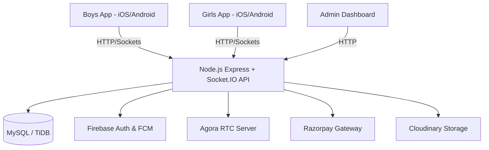

# 01. Project Overview

## 1. Project Name
The project is officially named **Pineapple**.

## 2. What the Project Does
Pineapple is a premium Indian social calling application. It facilitates direct, private 1-on-1 audio and video calls between male users ("boys") and verified female hosts ("girls" or "hosts").
* **Boys** can register, purchase coin packages, search or browse active female hosts, and initiate direct calls or join group audio rooms.
* **Girls** (hosts) can set their availability to "online" or "offline" and receive calls or virtual gifts from boys. They earn digital coins per minute of calling and can cash out these coins for real money.

## 3. Business Purpose
The business model is a companion calling platform centered around virtual micro-transactions:
* Male users purchase coin packs using Indian payment rails (Razorpay).
* These coins are spent dynamically per minute on calls (e.g., 1 coin/min for audio, 2 coins/min for video) or sent as digital gifts (such as roses or crowns).
* Female hosts receive a 70% share of the coin value (e.g., 0.7 coins/min for audio, 1.4 coins/min for video), which translates to real currency (INR) and can be withdrawn via UPI once they reach a minimum threshold of ₹100.
* The platform retains a 30% commission on all transactions.

## 4. Target Users
* **Boys / Male Users**: Aged 18–45, seeking private conversation, companions, or social entertainment.
* **Girls / Female Hosts**: Aged 18–35, seeking flexible, minute-based earnings and digital gifting revenue from their mobile devices.
* **Admin / Platform Owners**: Platform operators managing user accounts, verifying hosts, processing withdrawals, and moderating content.

## 5. Main User Types & Roles
1. **Boys (User)**: Verified male profiles. Can browse, call, purchase coins, play lucky spin, and rate hosts. Restricted from hosting calls or requesting withdrawals.
2. **Girls (Host)**: Female profiles verified by the admin console. Can receive calls, accept virtual gifts, view earnings, and submit UPI withdrawal requests. Restricted from buying coins or joining other streams as listeners.
3. **Admin (Operator)**: Platform owner accounts with full CRUD access to user database records, verification statuses, payout status tracking, and reporting logs.

## 6. Main Applications & Components
The Pineapple project is composed of the following key units:
* **Backend API (`backend`)**: Node.js + Express API server with a MySQL database interface. Contains all endpoints for authentication, calls, payment processing, notification routing, and admin control.
* **Signaling Engine (`backend/src/socket`)**: Socket.IO server running inside the backend process that coordinates incoming rings, call acceptance, and real-time room chat.
* **Admin Dashboard (`backend/admin`)**: Single-page HTML/JS dashboard that allows the operator to inspect logs, approve hosts, process withdrawals, and manage coin ledgers.
* **Marketing Website (`pineappleweb`)**: Static landing page presenting product highlights and download links.
* **Mobile Applications**:
  * `pineappleandroidboys`: React Native Android application configured for male users.
  * `pineappleandroidgirls`: React Native Android application configured for female hosts.
  * `pineappleios`: React Native iOS application configured for male users.
  * `pineapplegirlsios`: React Native iOS application configured for female hosts.

## 7. High-Level Architecture
The system follows a classic **client-server architecture** with external real-time stream servers:

## 8. Communication Protocols
* **REST APIs (HTTP/HTTPS)**: Used for all standard transactions (user profiles, coin purchase orders, reviews, reporting, withdrawal submissions).
* **WebSockets (Socket.IO)**: Used for live signalling (notifying a host of an incoming call, accepting/rejecting a call, ending a call, and real-time text chats in audio rooms).
* **WebRTC (Agora RTC SDK)**: Handles the peer-to-peer audio and video transmission once the call is accepted.
* **Push Notifications (Firebase FCM)**: Wakes up offline host devices when a boy initiates a call, prompting them with an incoming call screen.

## 9. Current Development Status
* **Backend**: **Complete**. All API controllers, database startup schema-migrations, socket signaling routines, and external service integrations (Agora, Razorpay, FCM, Cloudinary, Fast2SMS) are fully implemented.
* **Mobile Clients**: **Complete**. UI flows, settings, calling modules, and wallet screens are written and ready.
* **Admin Dashboard**: **Complete**. Client interface and backend routes are written and active.
* **Hosting / Environment Setup**: **Staging/Local State**. The apps are configured to point to a temporary Render domain or localhost. Submission to Apple App Store and Google Play is pending.
