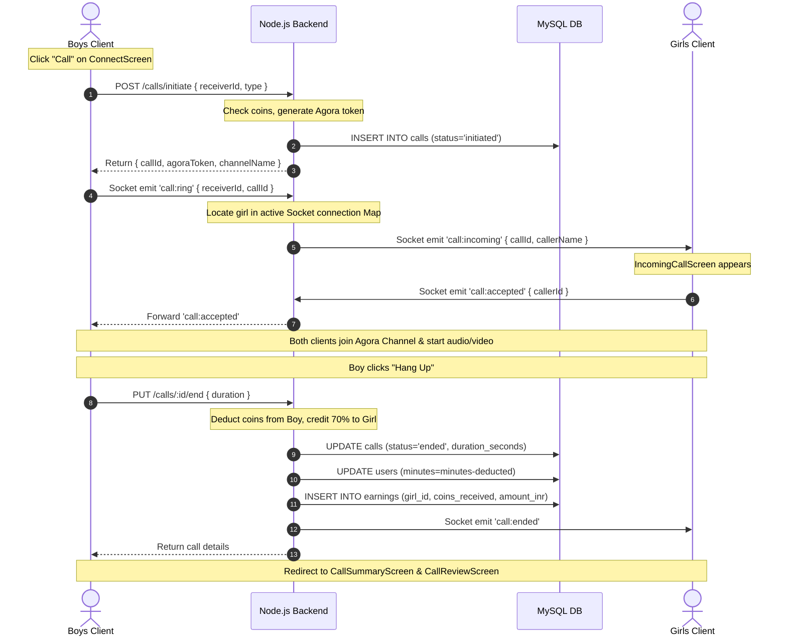

# 04. Applications and User Flows

This document details the distinct roles, screens, and workflows of each client application.

---

## 1. User Application Flows

### A. Boys App (`pineappleandroidboys` / `pineappleios`)
*   **Who Uses It**: Male users.
*   **Sign-In Method**: Mobile number + OTP (verifying via Fast2SMS/2Factor.in) or Google Sign-In via Firebase Auth.
*   **Navigation Structure**: Conditionally rendered screen-views managed by state in `GirlsHomeScreen.jsx` (which toggles between Matches, Calls, and Profile tabs).
*   **Main Screens**:
    *   `SplashScreen` / `OnboardingScreen1` / `LanguageScreen`: App launch and basic setups.
    *   `GenderScreen` & `GenderSelectionScreen`: Handles gender flow constraints.
    *   `LoginScreen` & `ProfileSetupScreen`: Mobile verification and initial profile photo setup.
    *   `ConnectScreen`: Main discovery feed listing active girls with stars, location, and Call button.
    *   `HomeScreen`: Grid view of girls categorized by tags.
    *   `LeaderboardScreen`: Lists top girls ranked by calls and ratings.
    *   `RoomsScreen` & `LiveRoomScreen`: Shows active audio group rooms. Boys can join and listen.
    *   `WalletScreen` & `PremiumPlansScreen`: Interface to buy coin packages via Razorpay.
    *   `LuckySpinScreen`: A spin-the-wheel game unlocked by premium users to win bonus coins.
    *   `AudioCallScreen` & `VideoCallScreen`: Live calling overlay.

### B. Girls App (`pineappleandroidgirls` / `pineapplegirlsios`)
*   **Who Uses It**: Female hosts.
*   **Sign-In Method**: Mobile number + OTP (verifying via Fast2SMS/2Factor.in) and age verification (must be 18–35 years old).
*   **Navigation Structure**: Tab bar toggles between Matches (redirects to Earnings), Calls (redirects to Recents), and Profile.
*   **Main Screens**:
    *   `GirlsHomeScreen`: Root host layout.
    *   `GirlsEarningsScreen`: Main dashboard showing coin balance, calls completed, today's income, and overall ratings.
    *   `GirlsRedeemScreen`: Form to enter a UPI ID and request coin cash-outs to real money.
    *   `IncomingCallScreen`: Dynamic modal that rings on top of the app when a boy calls. Shows Accept/Reject buttons.
    *   `AudioCallScreen` & `VideoCallScreen`: Host-side call overlay showing call timer and live earnings counter.
    *   `RecentsScreen`: Call history list.

---

## 2. Web and Admin Applications

### C. Web Application (`pineappleweb`)
*   **Who Uses It**: General public / prospective users.
*   **Sign-In Method**: Public access.
*   **Purpose**: Simple, high-performance static product website detailing the Pineapple app, layout screenshots, features, and direct app download buttons.

### D. Admin Dashboard (`backend/admin`)
*   **Who Uses It**: Platform owner / Moderator.
*   **Sign-In Method**: Admin password verification via the `/admin/login` API endpoint (which responds with an admin JWT token stored in `localStorage`).
*   **Main Components**:
    *   **Dashboard Overview**: General analytics metrics.
    *   **User Management**: Search user lists, block/suspend user accounts, delete users, and manually add coin balances.
    *   **Verification**: List pending host profiles and Approve/Reject them.
    *   **Withdrawals**: Review withdrawal cash-out logs and approve payouts once completed.
    *   **Reports**: Moderation screen listing user reports with Resolve and Suspend options.
    *   **Calls & Reviews**: Audits recent calling durations and rating review text.

---

## 3. Core Feature Walkthrough: Call Initiation and Ending

Here is a step-by-step trace of how a call starts and ends in the code:

### Trace Details in the Code:
1.  **Initiation**:
    *   Client triggers `initiateCall(receiverId, type)` from [`pineappleios/src/services/api.js`](file:///d:/cosmos%20internship/pineapple-app/pineappleios/src/services/api.js).
    *   Backend route [`backend/src/routes/calls.js`](file:///d:/cosmos%20internship/pineapple-app/backend/src/routes/calls.js) handles it at `POST /initiate`. It validates that the caller has enough coins (minimum 1 coin for audio, 2 for video) and calls `agora-access-token`'s `RtcTokenBuilder` to generate temporary tokens.
2.  **Ringing**:
    *   Client socket triggers `call:ring` in [`backend/src/socket/index.js`](file:///d:/cosmos%20internship/pineapple-app/backend/src/socket/index.js).
    *   If the girl is offline (not in socket map), backend sends an FCM push notification using `sendPush()` in [`backend/src/config/fcm.js`](file:///d:/cosmos%20internship/pineapple-app/backend/src/config/fcm.js) and returns `call:unavailable`.
3.  **Deductions & Earnings**:
    *   When the call ends, `PUT /calls/:id/end` is handled in `backend/src/routes/calls.js`.
    *   It updates the call duration in the `calls` database table.
    *   It deducts coins (represented by the database field `minutes`) from the boy's account in the `users` table.
    *   It calculates host earnings: `const amountInr = coinsEarned * 0.5;` (0.50 INR per coin) and inserts this into the `earnings` table.
