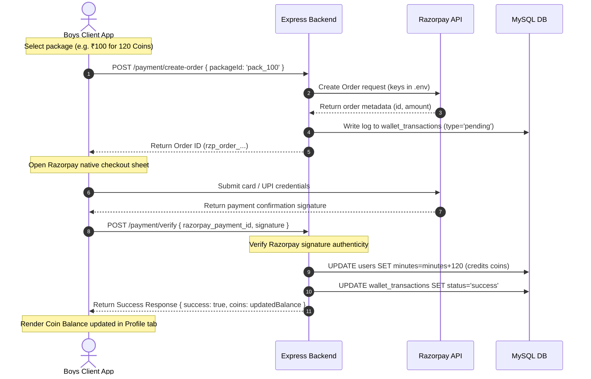

# 17. System Architecture and Request Flows

This document details the system design, communication routes, and request pathways.

---

## 1. High-Level System Architecture

Pineapple is built as a multi-client application backed by a unified Express API and database engine. 

```
                               ┌────────────────────────┐
                               │     Marketing Web      │
                               │    (pineappleweb)      │
                               └────────────────────────┘
                               
┌────────────────────────┐     ┌────────────────────────┐     ┌────────────────────────┐
│     Boys Mobile App    │     │    Girls Mobile App    │     │    Admin Dashboard     │
│   (Android/iOS Clones) │     │  (Android/iOS Clones)  │     │   (backend/admin)      │
└───────────┬────────────┘     └───────────┬────────────┘     └───────────┬────────────┘
            │                              │                              │
            │ HTTP REST / Socket.IO        │ HTTP REST / Socket.IO        │ HTTP REST
            └────────────────────────┐     │                              │
                                     ▼     ▼                              │
                               ┌───────────┴──────────────────────────────┴┐
                               │            Express API Backend            │
                               │                 (backend)                 │
                               └─────────────────────┬─────────────────────┘
                                                     │
                                                     ├─► Database [MySQL / TiDB]
                                                     │
                                                     ├─► Signaling [Socket.IO]
                                                     │
                                                     ├─► Media [Cloudinary]
                                                     │
                                                     ├─► Notifications [Firebase FCM]
                                                     │
                                                     ├─► Streams [Agora RTC SDK]
                                                     │
                                                     └─► Payments [Razorpay Gateway]
```

---

## 2. Request Flow Example: Buying Coins

Below is a trace of the transaction lifecycle when a user ("boy") purchases a coin pack:



### Trace Details in the Code:
1.  **Checkout Initialization**: The client triggers `createPaymentOrder(packageId)` inside `api.js`, calling `POST /payment/create-order`.
2.  **Order Registration**: The backend controller [`backend/src/routes/payment.js`](file:///d:/cosmos%20internship/pineapple-app/backend/src/routes/payment.js) instantiates a `Razorpay` client using `RAZORPAY_KEY_ID` and `RAZORPAY_KEY_SECRET`. It queries the selected package cost from the `coin_packages` table and initiates a Razorpay checkout request.
3.  **Balance Credit**: Once payment succeeds, the client posts verification parameters to `POST /payment/verify`. The backend verifies signature integrity using standard crypto HMAC hashes. Upon validation, it runs SQL queries to add coins to the user's account (`UPDATE users SET minutes=minutes+? WHERE id=?`).
