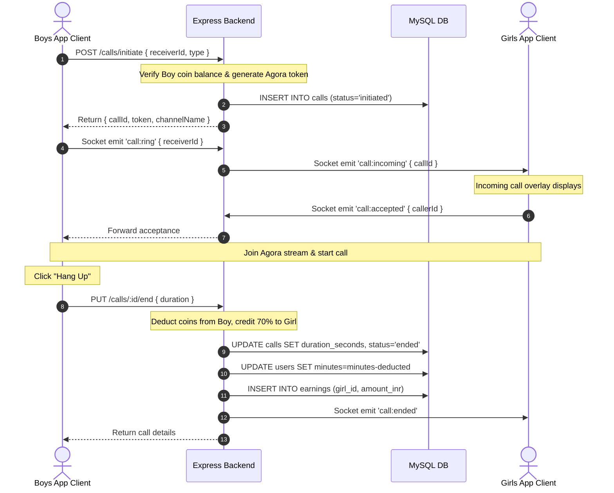

# Pineapple Master Project Documentation Handbook

This master document serves as the complete technical handover package for the **Pineapple** social calling application. It covers everything from high-level architecture to detailed database schemas, API logs, deployment guides, and onboarding checklists.

---

## Table of Contents
1. [Executive Summary](#1-executive-summary)
2. [Tech Stack Catalog](#2-tech-stack-catalog)
3. [Folder Structure Mapping](#3-folder-structure-mapping)
4. [User Types & Application Flows](#4-user-types--application-flows)
5. [System Architecture & Data Flows](#5-system-architecture--data-flows)
6. [API Route Catalog](#6-api-route-catalog)
7. [Database Schema & Relationships](#7-database-schema--relationships)
8. [Third-Party Integrations](#8-third-party-integrations)
9. [Safe Credentials & Env Inventory](#9-safe-credentials--env-inventory)
10. [Completed Features Matrix](#10-completed-features-matrix)
11. [Pending Work & Known Issues](#11-pending-work--known-issues)
12. [Local Development Setup Guide](#12-local-development-setup-guide)
13. [Deployment Workflows](#13-deployment-workflows)
14. [Developer Handover & Onboarding Checklist](#14-developer-handover--onboarding-checklist)

---

## 1. Executive Summary

### 1.1 What the Project Does
**Pineapple** is a premium social calling platform designed for the Indian mobile market. It facilitates direct, private 1-on-1 audio and video calls between male users ("boys") and verified female hosts ("girls" or "hosts").
* **Boys** can buy coin packages via local payment rails (Razorpay), browse online hosts, play mini-games, and initiate calls or join group audio rooms.
* **Girls** (hosts) set their online availability to receive incoming calls or virtual gifts from boys. They earn a per-minute coin rate and can request UPI cash-outs once they reach a minimum threshold of ₹100.

### 1.2 Core Business Flow
* **Monetization**: Male users buy coin packages. Spent coins are split: 70% goes to the female host's earnings ledger, and the platform retains a 30% commission.
* **Stream Signaling**: WebSocket routing handles incoming rings, call acceptance, and user online tracking. Real-time stream connections are established via the Agora RTC SDK once a call is accepted.
* **Admin Verification Gate**: A web-based Admin console handles host approvals, UPI cash-out requests, account suspensions, and call logs.

---

## 2. Tech Stack Catalog

### 2.1 Mobile Applications (React Native v0.85.2)
* **Framework**: React Native (compiled for iOS & Android).
* **State Management**: Redux Toolkit (`@reduxjs/toolkit` and `react-redux`).
* **Live Calling Streams**: `react-native-agora` (Agora RTC integration).
* **Signaling Client**: `socket.io-client`.
* **Payments**: `react-native-razorpay`.
* **Local Storage**: `@react-native-async-storage/async-storage`.

### 2.2 Backend Services
* **Runtime**: Node.js + Express.
* **Signaling Server**: Socket.IO.
* **Database**: MySQL / TiDB (via `mysql2/promise` pool).
* **Auth**: Custom JWT (`jsonwebtoken`) and Firebase Auth wrapper.
* **CDN Media Uploads**: `cloudinary` SDK.
* **Call Token Builder**: `agora-access-token`.

---

## 3. Folder Structure Mapping

```
pineapple-app/
├── GoogleService-Info_boys.plist       # Firebase iOS credentials - Boys app
├── GoogleService-Info_girls.plist      # Firebase iOS credentials - Girls app
├── google-services-boys.json           # Firebase Android credentials - Boys app
├── google-servicesgirls.json           # Firebase Android credentials - Girls app
├── Pineapple — Product Brief.pdf       # Core product design brief
├── PROJECT_DOCUMENTATION/              # Split documentation files
│
├── backend/                            # Node.js API + Web Admin Client
│   ├── admin/                          # Web Admin Dashboard SPA (HTML/JS/CSS)
│   ├── src/
│   │   ├── config/                     # Database, FCM, SMS, Agora configs
│   │   ├── middleware/                 # Auth interceptors
│   │   ├── routes/                     # Router controllers
│   │   ├── socket/                     # Socket.IO signaling event controller
│   │   └── index.js                    # Express startup entry point
│   ├── schema.sql                      # DDL schema definition
│   └── package.json
│
├── pineappleweb/                       # Static public web landing page
│   └── index.html
│
├── pineappleandroidboys/               # React Native Android - Boys
├── pineappleandroidgirls/              # React Native Android - Girls
├── pineappleios/                       # React Native iOS - Boys
└── pineapplegirlsios/                  # React Native iOS - Girls
```

---

## 4. User Types & Application Flows

1.  **Boys Client App**:
    *   **Access**: Mobile number verification via OTP or Google Firebase Auth.
    *   **Core Screens**: Connect Screen (profile feed with Call action), Categories Grid, Leaderboard (top-rated girls), Wallet (Razorpay buy menu), and Lucky Spin (premium reward game).
    *   **Navigation**: Dynamic state-driven screen toggling (`currentSubScreen`).
2.  **Girls Client App (Hosts)**:
    *   **Access**: Mobile number verification via OTP. Restricted to users aged 18–35.
    *   **Core Screens**: Earnings dashboard (total called minutes, live coin balances, INR rates), UPI Payout request form, and Incoming Call Ring overlay.
3.  **Admin Console**:
    *   **Access**: Admin password input (JWT stored locally).
    *   **Core Screens**: Overview Analytics, User Search (block profiles, add manual coin credits, delete profiles), Host Approval Flow, Payout resolution, and Complaint reports logs.

---

## 5. System Architecture & Data Flows

### 5.1 Call Signaling & Billing Flow
When a call is initiated:



---

## 6. API Route Catalog

### 6.1 Authentication (`/auth`)
*   `POST /auth/send-otp`: Sends mobile SMS verification codes.
*   `POST /auth/verify-otp`: Validates code and creates a user session.
*   `POST /auth/firebase-login` / `POST /auth/google`: Firebase-based login.
*   `POST /auth/fcm-token`: Updates the user's active device push notification token.

### 6.2 Users & Profiles (`/users`)
*   `GET /users/me` / `PUT /users/me`: Profile management.
*   `GET /users/live`: Lists active, verified online hosts.
*   `GET /users/top`: Leaderboard listing top-rated verified girls.
*   `POST /users/:id/rate`: Submits call rating comments and star scores.
*   `POST /users/:id/block`: Blocks another user.

### 6.3 Calling (`/calls`)
*   `POST /calls/initiate`: Initiates a call. Generates Agora RTC credentials.
*   `PUT /calls/:id/end`: Calculates call duration, deducts coins, and credits host earnings.

### 6.4 Payments (`/payment` & `/wallet`)
*   `POST /payment/create-order`: Generates a Razorpay order ID.
*   `POST /payment/verify`: Validates signatures and credits coins.
*   `GET /wallet`: Wallet transactions ledger history.

---

## 7. Database Schema & Relationships

The database is built on **MySQL / TiDB**.

*   **`users`**: Profiles for both boys and girls. Coin balances are stored in the `minutes` column. Girls use `is_verified` to determine visibility.
*   **`calls`**: Logs caller, receiver, channel name, status, duration, and coins deducted.
*   **`earnings`**: Tracks credits applied to verified hosts per call.
*   **`withdrawals`**: Log of payout requests containing the host's UPI ID and request status.
*   **`rooms`** / **`room_members`**: Live group audio room parameters.
*   **`gifts`**: Logs of digital gifts sent by boys to girls.

---

## 8. Third-Party Integrations

1.  **Firebase**: Manages client authentication and routes push notifications via Firebase Cloud Messaging (FCM).
2.  **Agora**: Generates temp tokens on the backend and streams calling data on the client.
3.  **Razorpay**: Handles card and UPI payments for coin packages.
4.  **Cloudinary**: Hosts user profile avatars.
5.  **Fast2SMS & 2Factor.in**: Sends login verification codes via SMS or Voice.

---

## 9. Safe Credentials & Env Inventory

> [!WARNING]
> Credentials and secret values are hidden to maintain repository security.

All environment keys must reside inside the [`backend/.env`](file:///d:/cosmos%20internship/pineapple-app/backend/.env) configuration file.

*   `DB_HOST` / `DB_PORT` / `DB_USER` / `DB_PASS` / `DB_NAME`: Database credentials.
*   `AGORA_APP_ID` / `AGORA_APP_CERTIFICATE`: Agora RTC credentials.
*   `RAZORPAY_KEY_ID` / `RAZORPAY_KEY_SECRET`: Razorpay gateway API keys.
*   `CLOUDINARY_CLOUD_NAME` / `CLOUDINARY_API_KEY` / `CLOUDINARY_API_SECRET`: Cloudinary CDN API keys.
*   `FAST2SMS_API_KEY` / `TWOFACTOR_API_KEY`: SMS OTP keys.
*   `JWT_SECRET`: Signs user session tokens.
*   `ADMIN_PASSWORD`: Access code for the Web Admin dashboard.

---

## 10. Completed Features Matrix

| Feature | Boys App | Girls App | Admin Console | Backend API | Status |
| :--- | :---: | :---: | :---: | :---: | :---: |
| **Phone & Google Login** | Yes | Yes | No | Yes | ✅ **COMPLETE** |
| **Video & Audio Calls** | Yes | Yes | No | Yes | ✅ **COMPLETE** |
| **Coin Purchases** | Yes | No | No | Yes | ✅ **COMPLETE** |
| **UPI Payout Requests** | No | Yes | Yes | Yes | ✅ **COMPLETE** |
| **Host Verification Flow**| No | No | Yes | Yes | ✅ **COMPLETE** |
| **Live Audio Rooms** | Yes | No | No | Yes | ✅ **COMPLETE** |
| **Lucky Spin Minigame** | Yes | No | No | Yes | ✅ **COMPLETE** |
| **User Suspensions** | No | No | Yes | Yes | ✅ **COMPLETE** |

---

## 11. Pending Work & Known Issues

### 11.1 Critical Build Blocker: Gradle 9 + Foojay Resolver Crash
The project uses **Gradle 9.3.1**. The Foojay convention plugin loaded by Kotlin queries java toolchains but references `JvmVendorSpec.IBM_SEMERU` (which was removed in Gradle 9.0). This causes a build crash on boot.
*   *Recommended Fix*: Downgrade the wrapper version in `gradle-wrapper.properties` to **`8.10.2`** (which has stable compatibility with Foojay resolvers and React Native `0.85`).

### 11.2 Firebase Dual Initialization Crash
Both `firebase.js` and `fcm.js` call `admin.initializeApp()`. In Firebase, calling this multiple times on the default app name causes a runtime crash.
*   *Recommended Fix*: Initialize the Firebase Admin SDK once globally inside `firebase.js` and export the initialized `admin` instance for other modules to reuse.

---

## 12. Local Development Setup Guide

### 12.1 Launch Local Database
Ensure Docker Desktop is open and run:
```powershell
docker run --name pineapple-mysql -e MYSQL_ROOT_PASSWORD="" -e MYSQL_DATABASE="pineapple" -p 3306:3306 -d mysql:8.0 --allow-no-password
```

### 12.2 Install Dependencies
Run package installations in both the `backend` and target mobile app directories (e.g. `pineappleandroidboys`):
```powershell
cd backend && npm ci
cd ../pineappleandroidboys && npm ci
```

### 12.3 Compile and Launch App
1.  **Start backend**: Run `npm run dev` in the `backend` directory.
2.  **Start Metro**: Run `npm start` in the mobile app directory.
3.  **Run App**: Set the JVM path to use Java 21 and launch the Android compilation:
    ```powershell
    $env:JAVA_HOME = "C:\Program Files\Android\Android Studio\jbr"
    npm run android
    ```

---

## 13. Deployment Workflows

*   **Backend Hosting**: Deploy to cloud instances (AWS EC2, DigitalOcean, Render) and run via PM2: `pm2 start src/index.js --name "pineapple-backend"`.
*   **Web Marketing**: Host the plain assets of the `pineappleweb` folder on Cloudflare Pages or Netlify.
*   **Android App Release**: Generate your signing keystore, place it in `android/app/`, configure release credentials inside `build.gradle`, and run:
    ```powershell
    $env:JAVA_HOME = "C:\Program Files\Android\Android Studio\jbr"
    ./gradlew bundleRelease
    ```

---

## 14. Developer Handover & Onboarding Checklist

1.  **Connecting Frontend to Backend**:
    The API client routing resides in [`api.js`](file:///d:/cosmos%20internship/pineapple-app/pineappleios/src/services/api.js). To point to a local backend instead of the staging Render server, update the `NGROK_URL` or `IS_REAL_DEVICE` parameter in this file.
2.  **Adding a New API**:
    Define your route module inside `backend/src/routes/` and register it in `backend/src/index.js` using `app.use()`.
3.  **Adding a New Screen**:
    Create the JSX view file inside the mobile app's `src/screens/` directory. Add your new screen to the home state-toggle maps inside the layout wrapper.
4.  **Avoid Modifying**:
    Do not modify `android/app/build.gradle` or native compile targets unless you are upgrading library packages.
5.  **Secrets Policy**:
    Never commit `.env` files or Firebase SDK keys to version control.
